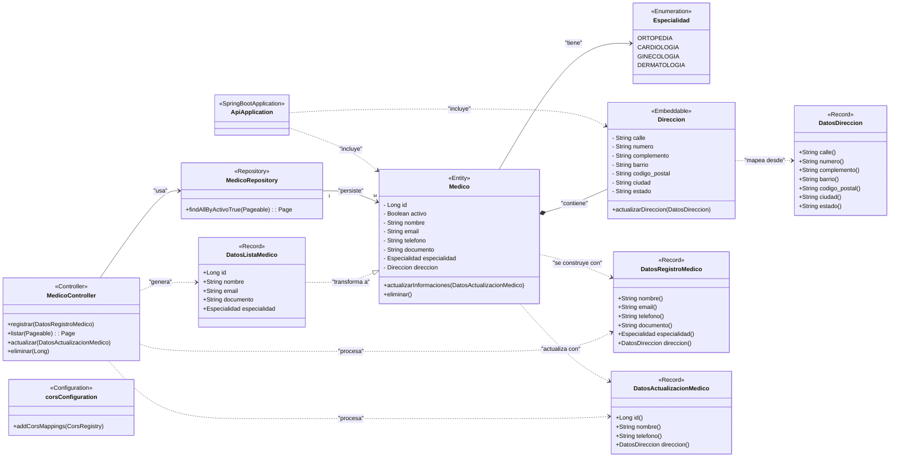

# Medicina Alura Latam  

## Estado del Proyecto
🚧 En desarrollo (v0.1.0)  
✅ Funcionalidades completadas: CRUD Médicos  
⏳ Próximas features: Autenticación JWT, Sistema de Citas

## Descripción
Proyecto backend para gestión médica desarrollado durante el curso de Alura Latam, utilizando Spring Boot 3 y Java 17.

##

## Stack Tecnológico
| Capa           | Tecnologías              |
|----------------|--------------------------|
| Backend        | Spring Boot 3, Java 17   |
| Persistencia   | MySQL, Hibernate, Flyway |
| Herramientas   | Lombok, Maven, Insomnia  |

## Configuración Básica
```properties
# application.properties
spring.datasource.url=jdbc:mysql://localhost:3306/clinica
spring.jpa.hibernate.ddl-auto=validate
```

##

## Versiones LTS / ¿Qué son?

Las versiones LTS (Long Term Support) son versiones con soporte extendido y actualizaciones de seguridad por varios años.  
Se recomienda usarlas en producción para mayor estabilidad.

##

## Nomenclatura de comentarios de Git

| Prefijo   | Descripción                                         |
| --------- | ------------------------------------------------- |
| `feat:`   | Nueva funcionalidad                                |
| `fix:`    | Corrección de bugs                                 |
| `docs:`   | Cambios en documentación                           |
| `style:`  | Cambios de formato (no funcionales)               |
| `refactor:` | Reestructuración de código                       |
| `test:`   | Añadir o mejorar pruebas                           |
| `chore:`  | Tareas menores (actualizar dependencias, config) |

##

## Instalación y Ejecución

Para correr el proyecto backend:

```bash
./mvnw clean install
./mvnw spring-boot:run
```

